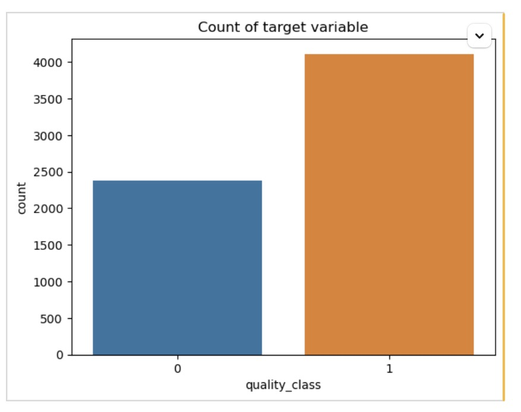
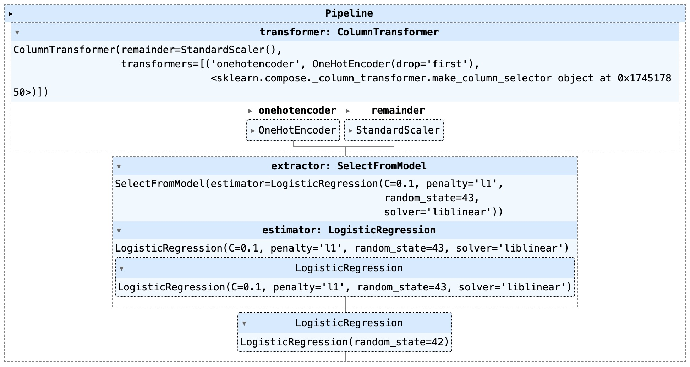
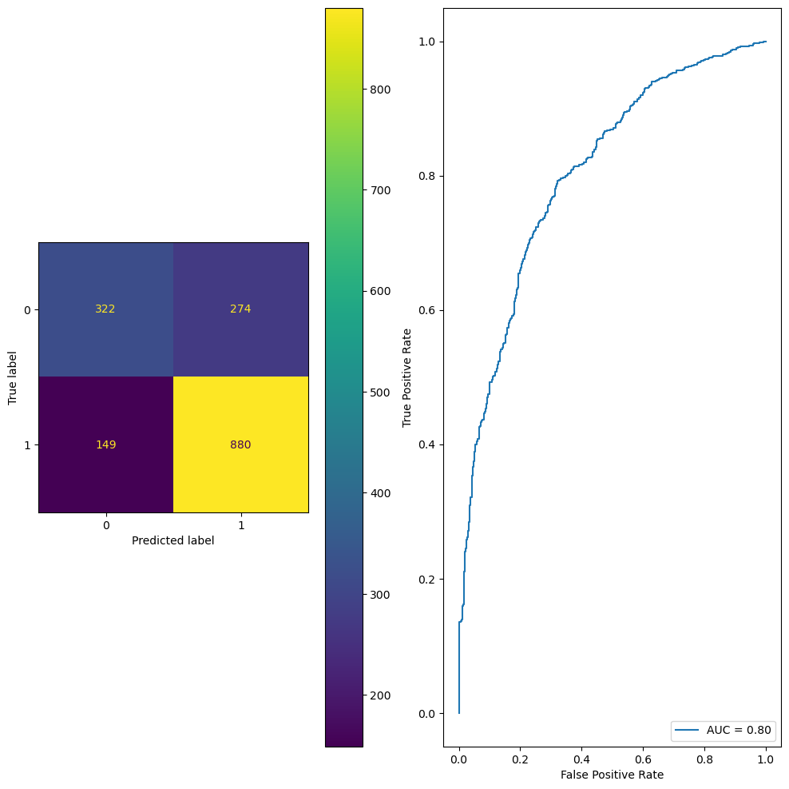

## Wine Quality Classification Project

### Goal

Develop a classification model to classify the quality of *Vinho Verde* wines (red and white) from Northern Portugal.  
Dataset Source: [UCI Wine Quality Dataset](https://archive.ics.uci.edu/dataset/186/wine+quality).

-   **Objective**: Predict wine quality as:

    -   **Class 0** (Low quality: scores 0-5)

    -   **Class 1** (High quality: scores 6-10)

-   **Approach**: Previously modeled as a regression problem, now reframed as a classification problem.

### Business Problem

1.  **Quality Assurance**:

    -   Ensure only high-quality wines proceed to bottling and distribution.

    -   Reduce the risk of releasing low-quality wines to the market.

2.  **Process Adjustments**:

    -   Identify significant chemical properties affecting wine quality.

    -   Adjust production parameters like fermentation and ingredient proportions to enhance quality.

### Dataset Overview

Combined red (1,599 samples) and white (4,898 samples) wines with a new category column:

-   wine_type = 'red' or 'white'.

The dataset includes 13 attributes, with 12 independent features and 1 target feature.

**Features**

1.  Fixed acidity

2.  Volatile acidity

3.  Citric acid

4.  Residual sugar

5.  Chlorides

6.  Free sulfur dioxide

7.  Total sulfur dioxide

8.  Density

9.  pH

10. Sulphates

11. Alcohol

12. Wine type

**Target Variable**

-   Replaced original quality score (0-10) with a binary **quality_class**:

    -   **Class 0**: Low quality (scores 0-5).

    -   **Class 1**: High quality (scores 6-10).

quality_class

1 0.633231

0 0.366769

### Modeling Process

#### 1. Data Splitting

-   Split data into training (80%) and testing (20%) sets.

-   Used stratification to maintain class proportions.

#### 2. Feature Transformation

-   Encoded wine_type (categorical feature) using OneHotEncoder.

-   Scaled numeric features for uniformity.

#### 3. Classification Model

-   Logistic Regression used for binary classification.

-   **Evaluation Metrics**:

    -   F1 Score = **0.8068**.

    -   AUC Score = **0.8030**.

Best Parameters: {'extractor__estimator__C': 1.0, 'model__C': 1.0, 'model__penalty': 'l2'}

Best F1 Score: 0.8068173486174984

### Model Results

#### Confusion Matrix

-   Reliable classification of both high and low-quality wines.

    

#### Selected Features and Coefficients

| **Feature**          | **Coefficient** |
|----------------------|-----------------|
| Alcohol              | 0.922           |
| Residual sugar       | 0.609           |
| Sulphates            | 0.342           |
| Free sulfur dioxide  | 0.263           |
| pH                   | 0.139           |
| Fixed acidity        | 0.128           |
| Chlorides            | -0.026          |
| Citric acid          | -0.059          |
| Total sulfur dioxide | -0.316          |
| Density              | -0.482          |
| White wine (encoded) | -0.675          |
| Volatile acidity     | -0.782          |

#### Key Insights

-   **Alcohol** is the most significant predictor of high-quality wine.

-   **Residual sugar** and **sulphates** positively influence wine quality.

-   **Volatile acidity** and **density** negatively affect wine quality.

-   **Wine type** (white vs. red) slightly negatively impacts high-quality classification.

### Conclusion

The logistic regression model effectively classifies wine quality, aiding **quality assurance** and enabling **process adjustments** in wine production. Its high F1 score and AUC demonstrate reliable performance in distinguishing high and low-quality wines.
